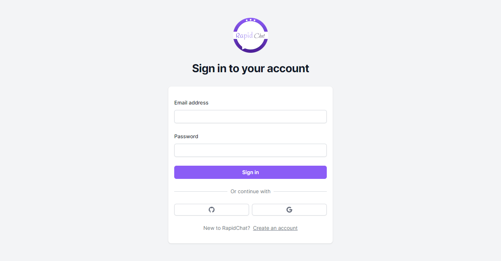
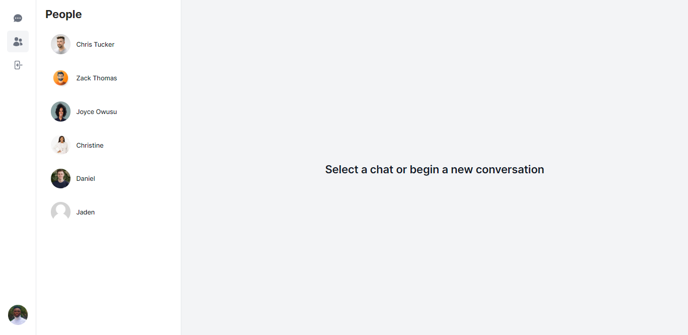
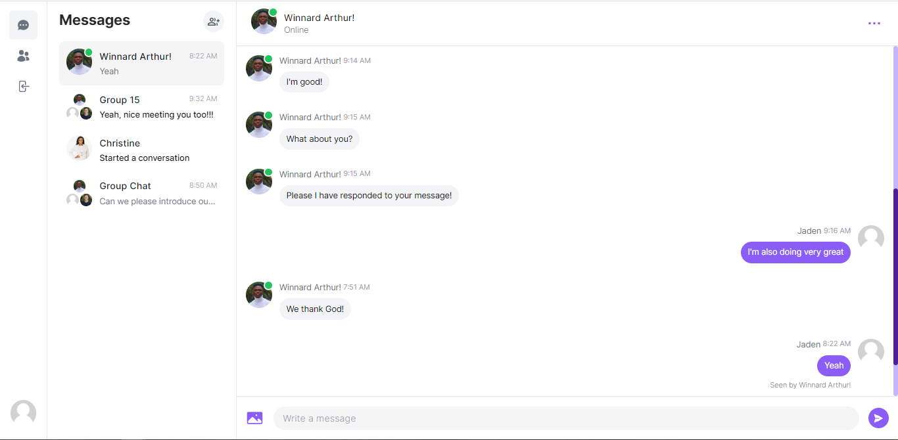
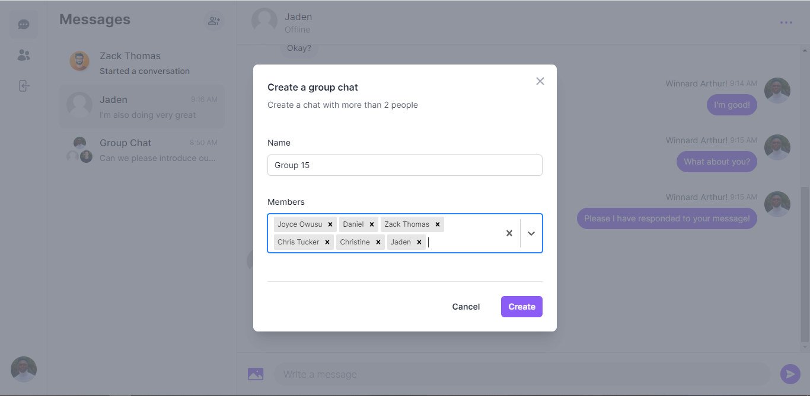
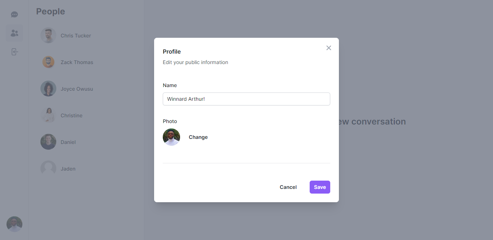
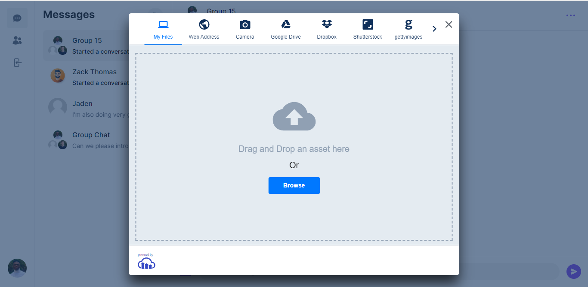

# RapidChat Application

RapidChat is a fullstack instant chat/messaging application built with Nextjs 13 AppRouter, typescript, mongoDB, prisma, pusher, zustand, etc...

## Key Features
- Authentication (Credentials, Google, GitHub)
- Real-time/Instant messaging using pusher  
- One on one messaging/chats
- Group chats/messaging
- Online/Offline user status
- Message notifications
- Message read receipts
- Message attachments
- User profile settings & customization
- Tailwindcss & HeadlessUI for smooth animations and UI
- File & Image Upload
- Responsiveness on all devices
- Personalized Logo with Figma

## Authentication


## Users


## Messages/Chats


## Create Group 


## Group Messages/Chats


## User Profile & Settings


## Image/File Uploads



## Setup Prisma
```bash 
npx prisma db push
```

## Available scripts

First run the development server:

```bash
npm run dev
# or
yarn dev
# or
pnpm dev
```

Open [http://localhost:3000](http://localhost:3000) with your browser to see the result.

The page will reload when you make changes.\
You may also see any lint warnings in the console.

## Deployment

You can find a demo of RapidChat application at [RapidChat](https://rapidchat-sigma.vercel.app/)
